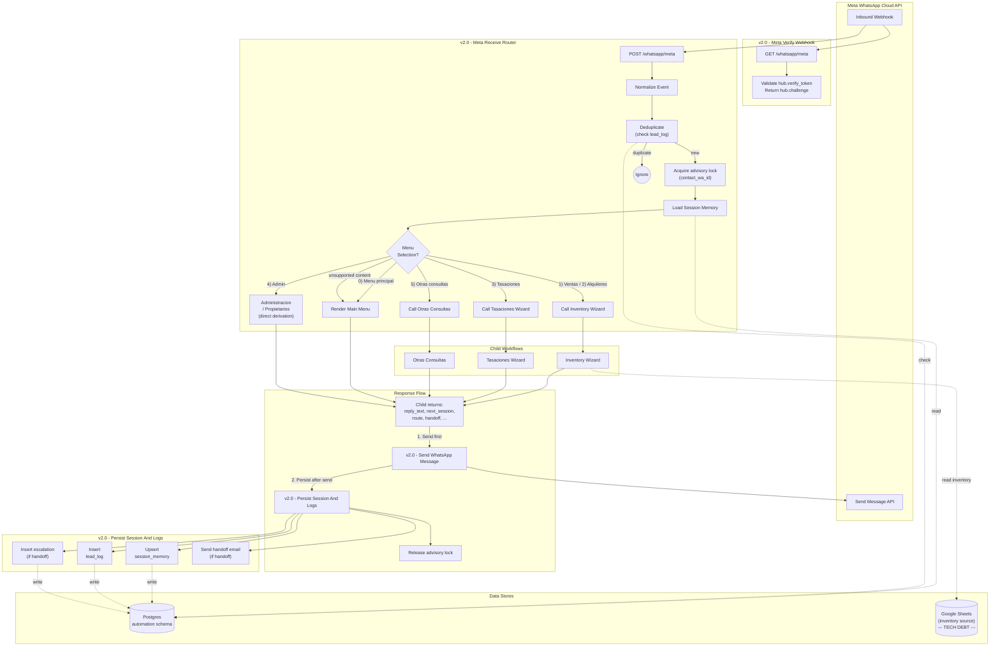

# WhatsApp automation (n8n)

Source: `C:\Desarollo\jperez\n8n\whatsapp-automation-claude`

The platform runs on n8n. The same set of workflows is deployed to each tenant's own n8n instance — the workflow JSON is the unit of distribution. Per-agency adaptation = clone the wizard JSON files and rewrite the JS state machine inside; leave the engine workflows (router, sender, persister, error handler, sync) untouched.

## Workflow files (the engine)

| File | Role | Vertical-specific? |
|---|---|---|
| `v2-meta-receive-router.json` | Entry. GET (verification) + POST (receive). Normalize, dedup, lock, session load, route. | No — router/lock/dedup is generic |
| `v2-send-whatsapp-message.json` | Shared sender. Wraps Meta `/messages` POST. | No |
| `v2-persist-session-and-logs.json` | Shared persister. Upsert `session_memory`, insert `lead_log` (in + out), conditionally insert `escalations`, send SMTP handoff email. | No |
| `v2-error-handler.json` | Global error trap. Log to `escalations`, throttled alert email, fallback WhatsApp message to user. | No |
| `v2-sync-inventory.json` | Cron 15-min: Sheets → `automation.inventory` upsert. | Mostly no — schema generic, source ID is per-tenant |
| `v2-inventory-wizard.json` | 5-step search wizard (single Code node JS state machine). | **Yes** — vocabulary is real-estate |
| `v2-tasaciones-wizard.json` | 6-step valuation form. | **Yes** — vocabulary is real-estate |
| `v2-otras-consultas.json` | 3-step general inquiry form. | Mostly no — generic intake pattern |
| `v2-emprendimientos.json` | Project listing + advisor handoff. | **Yes** — vocabulary is real-estate |

## Architecture diagram (verbatim from `architecture-v2.md`)



## Execution order (per inbound message)

```
1.  POST /whatsapp/meta fires (Meta webhook)
2.  Respond immediately with onReceived (don't keep Meta waiting)
3.  Normalize event — extract text_body, contact_wa_id, message_id, profile_name, message_type
4.  Check for duplicate (direction='inbound', message_id) in automation.lead_log
    — if found, short-circuit and exit (idempotency)
5.  Acquire Postgres advisory lock on hash(contact_wa_id)
    — guarantees serialized processing per contact
6.  Load session from automation.session_memory by contact_wa_id
    — apply SESSION_MEMORY_TTL_MS (default 30 min) — if stale, treat as new session
7.  Determine menu selection or resume guided flow
    — main menu 0-5 / admin / restart
8.  Call appropriate child workflow with { session, normalized_event }
9.  Child returns shared contract:
    {
      reply_text:               string,
      next_session:             updated session_memory shape,
      route:                    string ID of the child + step,
      handoff:                  boolean,
      escalation_reason:        string or empty,
      handoff_target:           string ('valuations'|'sales'|'rents'|'questions'|...),
      preferred_contact_slot:   string or empty,
      qualification_snapshot:   JSONB to merge into session_memory,
      matched_listings:         array (optional, from inventory wizard),
      should_update_session:    boolean (false for read-only turns)
    }
10. Call v2-send-whatsapp-message — POST to Meta with reply_text, capture outbound_message_id
11. Call v2-persist-session-and-logs:
    — upsert session_memory (if should_update_session)
    — insert lead_log (inbound row)
    — insert lead_log (outbound row) with related_message_id linking back
    — if handoff: insert escalations row + send SMTP alert
12. Release advisory lock
```

## Wizard pattern (the part you'll copy per vertical)

Every wizard is **a single n8n Code node** containing a JavaScript state machine. The Code node receives `{ session, normalized_event }` from Execute Workflow, switches on `session.last_route` (current step) + the inbound text, and returns the shared contract.

Why one big Code node instead of fan-out across many small nodes:

- The state machine is easier to read and modify in one file.
- Step transitions are pure functions, easy to unit-test (you can copy the function out of the JSON and run it locally).
- Avoids dozens of n8n branches/IFs that would be hard to maintain.

A wizard's typical shape:

```js
// Pseudocode of the wizard pattern
const STEPS = ['ask_zone', 'ask_property_type', 'ask_bedrooms', 'ask_price_range', 'show_results'];

function buildPrompt({ title, instruction, options }) {
  // Returns the WhatsApp-formatted text including '0) Menu principal' footer
}

function handle({ session, normalized_event }) {
  const currentStep = session.last_route?.split(':')[1] ?? STEPS[0];
  const userText = normalized_event.text_body.trim();

  // Restart shortcut
  if (userText === '0') return { reply_text: renderMainMenu(), next_session: clearGuidedState(session), route: 'menu', handoff: false, qualification_snapshot: {}, should_update_session: true };

  switch (currentStep) {
    case 'ask_zone':
      // parse zone, advance
    case 'ask_property_type':
      // ...
    case 'show_results':
      // query inventory, return matched_listings
      // if user picks a listing → handoff: true, handoff_target: 'sales'
  }
}
```

The wizards in v2 follow this shape with significant length (`v2-inventory-wizard.json` is ~29 KB; the JS inside is a couple thousand lines).

## Error handler

`v2-error-handler.json` is wired as the **global Error Workflow** in n8n settings. When any other workflow throws:

1. Log to `automation.escalations` with `escalation_type='workflow_error'`, full execution context (`workflow_name`, `execution_id`, `workflow_id`, `execution_url`, `last_node_executed`, `mode`, `stack`).
2. Send a throttled alert email to `ALERT_EMAIL_TO` (don't drown the inbox on cascading failures).
3. If `contact_wa_id` is recoverable from the failed execution, send a fallback WhatsApp message to the user ("estamos teniendo un problema, te respondemos a la brevedad" or similar) so the conversation doesn't die silently.

This is why the dashboard's `escalations` queries filter on `escalation_type` to separate operational errors from real customer handoffs.

## Sync workflow

`v2-sync-inventory.json` runs every 15 minutes:

1. Read sales sheet (Google Sheets node, OAuth2 cred).
2. Read rents sheet.
3. Build upsert SQL keyed on composite PK `(listing_id, source_sheet)`.
4. Execute against Postgres `automation.inventory`.

**Tech debt:** the inventory wizard still reads Sheets at runtime instead of `automation.inventory`. The sync table is populated but unused by the runtime path. Ideal refactor swaps wizard reads to Postgres for resilience + speed.

## Required environment variables

The n8n instance needs these. Names are stable across agencies; **values are per-tenant** (each tenant has their own Meta access token, phone number, sheet, alert email).

**Required:**
- `META_VERIFY_TOKEN` — webhook verification token (you choose; must match Meta app config)
- `META_ACCESS_TOKEN` — Meta business integration token (rotate per tenant; encrypted in the Tech Provider backend's `credentials` table)
- `META_PHONE_NUMBER_ID` — tenant's WhatsApp phone number ID
- `ALERT_EMAIL_TO` — where handoff + error alerts go
- `ALERT_FROM_EMAIL` — SMTP sender

**Optional / per-vertical:**
- `META_GRAPH_VERSION` — default `v22.0`
- `SESSION_MEMORY_TTL_MS` — default `1800000` (30 min)
- `DEFAULT_ASSISTANT_LANGUAGE` — default `es`
- `REAL_ESTATE_*` — vertical-specific overrides (currency, market name, brand name); for non-real-estate verticals, define your own `<VERTICAL>_*` set
- `OWNERS_WHATSAPP_NUMBER`, `VALUATIONS_WHATSAPP_NUMBER`, `QUESTIONS_WHATSAPP_NUMBER`, `SALES_WHATSAPP_NUMBER`, `RENTS_WHATSAPP_NUMBER` — per-team internal notification numbers (handoff_target → number)
- `OPENAI_API_KEY`, `OPENAI_MODEL` (default `gpt-4o-mini`), `AI_CONFIDENCE_THRESHOLD` (default `0.6`) — wired but **not used** in v2 wizards (planned for "Otras Consultas" AI triage)

**Sheet ID:** in current real-estate code, hardcoded as `REAL_ESTATE_SHEET_ID=1u4YkqBlPSN6UrUW_ra4hYWuRzEj8fxNp3xqWjjV1-LY` in n8n's variables. Per-tenant: each tenant has their own Sheet ID + their own Google OAuth credential.

## Post-deploy wiring operations

When importing the platform's workflows into a fresh tenant's n8n instance, **don't paste JSONs through MCP `n8n_create_workflow` one-by-one** — for the router alone (21 nodes) that blows up Claude's context fast. The pattern proven on Plec (2026-05-08) and worth reusing:

### 1. Bulk-import via REST API

Write a small Node script (~50 lines) that:
- Reads each `n8n/wizards/v2-*.json` in dependency order (engines → wizards → sync → router last)
- Strips n8n-export-only fields (`pinData`, `meta`, `tags`, `active`, `versionId`) leaving only `{name, nodes, connections, settings}`
- POSTs each to `<n8n-url>/api/v1/workflows` with `X-N8N-API-KEY` header
- Lists existing workflows first to skip duplicates (idempotent re-runs)
- Persists a `manifest.json` keyed `fileName → {id, name}` for the wiring step

Reference implementation: `C:\Desarollo\jperez\plecarquitectos\Plec Automation\scripts\import-n8n.mjs`. Reuse it for any new tenant — just change the API URL.

### 2. Credentials

- `n8n_manage_credentials` MCP action `list` is **not supported** by n8n's public API (returns `GET method not allowed`). The only way to discover an existing credential's ID is via the n8n UI URL.
- `n8n_manage_credentials` `create` works and returns the ID. Use it for Postgres + any non-OAuth credential.
- **OAuth-flow credentials (Google Sheets, etc.) cannot be created via API** — they require a browser popup for the consent dance. Pre-create the shell via MCP if you want to save UI clicks, but the user has to click "Sign in" themselves.

### 3. Wire executeWorkflow IDs + attach credentials via MCP

Use `n8n_update_partial_workflow` with `updateNode` ops. One MCP call can patch many nodes in one workflow:

```jsonc
// Wire all 8 executeWorkflow nodes in the router in one call:
{
  "id": "<router-id>",
  "operations": [
    {"type": "updateNode", "nodeName": "Call Proyecto Wizard",
     "updates": {"parameters.workflowId": "<proyecto-id>"}},
    // ... 7 more
  ]
}

// Attach Postgres credential to many nodes across one workflow:
{
  "id": "<workflow-id>",
  "operations": [
    {"type": "updateNode", "nodeName": "Read Lead Log",
     "updates": {"credentials.postgres": {"id": "<cred-id>", "name": "Postgres <Tenant>"}}},
    // ...
  ]
}
```

### 4. Global error workflow — there isn't one

n8n's API does **not** expose a "global default error workflow" setting. The `errorWorkflow` lives in each workflow's `settings.errorWorkflow`. To wire it across all workflows: PUT loop over each non-error-handler workflow setting `settings.errorWorkflow = <error-handler-id>`. Reference: `scripts/set-error-workflow.mjs` in `Plec Automation/`.

The error handler itself does *not* get its own errorWorkflow (avoid infinite loop on cascading failures).

### 5. Patching jsCode after import (for vertical-specific tweaks)

When the user discovers their Sheet shape differs from the platform's expectations (very common — see "Sheet schema considerations" in `new-vertical-playbook.md`), edit `_src/<file>.js` → rebuild via `node scripts/wizards/build.mjs` → push the new jsCode without re-importing (which would change the ID and break wiring):

1. GET `/workflows/<id>` to fetch the live workflow
2. Find the target Code node, swap `parameters.jsCode`
3. PUT `/workflows/<id>` with the same `{name, nodes, connections, settings}` — credentials and connection wiring are preserved

Reference: `scripts/update-sync-jscode.mjs` in `Plec Automation/`.

### 6. Validator false positives to ignore

`n8n_validate_workflow` from n8n-mcp has known false positives — don't panic:

- **"Unmatched expression brackets"** on jsCode containing bracket notation (`obj['key']`) or template literals (`${...}`). The "Current" and "Fixed" shown in the error are identical. Ignore.
- **"Send Email" node should be on error path"** when fan-out from a Code node intentionally includes a `Send …Email` sibling on the success path (e.g., handoff notification). Ignore.
- **"Outdated typeVersion"** warnings — annoying but harmless. The workflows run fine on the older versions.

Real lint items to fix: `responseNode mode requires onError: continueRegularOutput` on webhook nodes; missing `onError: continueErrorOutput` on Switch nodes that have an error output configured.

## Cross-references

For n8n mechanics (not specific to this platform), consult the `n8n-mcp-skills` family:

- `n8n-mcp-skills:n8n-workflow-patterns` — how to design webhook + DB + AI agent workflows generally
- `n8n-mcp-skills:n8n-code-javascript` — `$input`/`$json`/`$node` syntax inside Code nodes; this platform's wizards lean heavily on Code nodes
- `n8n-mcp-skills:n8n-expression-syntax` — `{{ }}` patterns, common errors
- `n8n-mcp-skills:n8n-validation-expert` — interpreting `validate_workflow` errors
