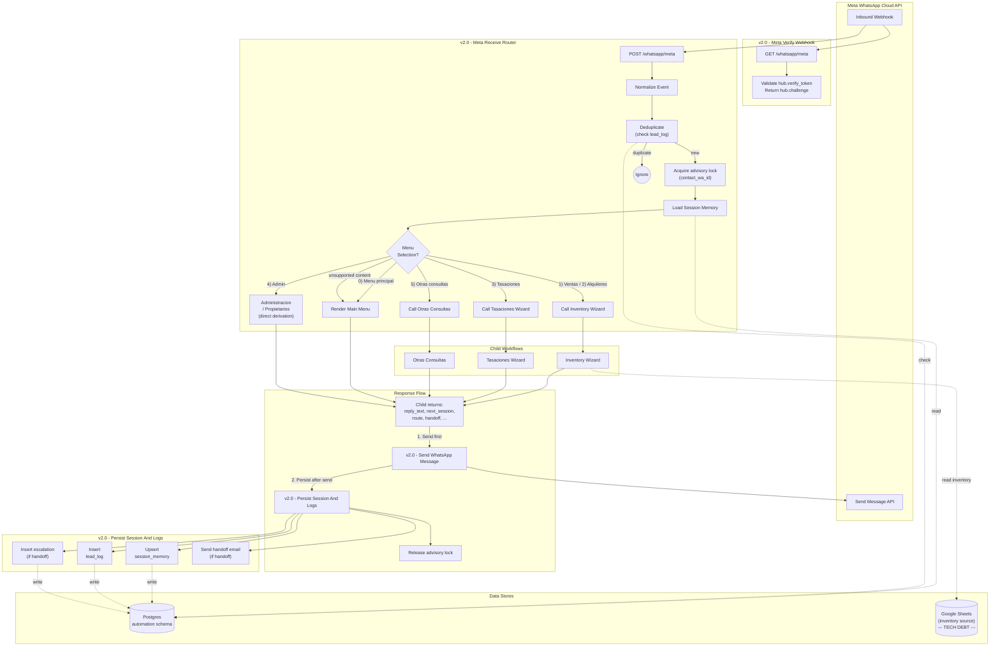

# WhatsApp automation (n8n)

Source: `C:\Desarollo\jperez\n8n\whatsapp-automation-claude`

The platform runs on n8n. The same set of workflows is deployed to each tenant's own n8n instance — the workflow JSON is the unit of distribution. Per-agency adaptation = clone the wizard JSON files and rewrite the JS state machine inside; leave the engine workflows (router, sender, persister, error handler, sync) untouched.

## Workflow files (the engine)

| File | Role | Vertical-specific? |
|---|---|---|
| `v2-meta-receive-router.json` | Entry. GET (verification) + POST (receive). Normalize, dedup, lock, session load, route. | No — router/lock/dedup is generic |
| `v2-send-whatsapp-message.json` | Shared sender. Wraps Meta `/messages` POST. | No |
| `v2-persist-session-and-logs.json` | Shared persister. Upsert `session_memory`, insert `lead_log` (in + out), conditionally insert `escalations`, send SMTP handoff email. | No |
| `v2-error-handler.json` | Global error trap. Log to `escalations`, throttled alert email, fallback WhatsApp message to user. | No |
| `v2-sync-inventory.json` | Cron 15-min: Sheets → `automation.inventory` upsert. | Mostly no — schema generic, source ID is per-tenant |
| `v2-inventory-wizard.json` | 5-step search wizard (single Code node JS state machine). | **Yes** — vocabulary is real-estate |
| `v2-tasaciones-wizard.json` | 6-step valuation form. | **Yes** — vocabulary is real-estate |
| `v2-otras-consultas.json` | 3-step general inquiry form. | Mostly no — generic intake pattern |
| `v2-emprendimientos.json` | Project listing + advisor handoff. | **Yes** — vocabulary is real-estate |

## Architecture diagram (verbatim from `architecture-v2.md`)



## Execution order (per inbound message)

```
1.  POST /whatsapp/meta fires (Meta webhook)
2.  Respond immediately with onReceived (don't keep Meta waiting)
3.  Normalize event — extract text_body, contact_wa_id, message_id, profile_name, message_type
4.  Check for duplicate (direction='inbound', message_id) in automation.lead_log
    — if found, short-circuit and exit (idempotency)
5.  Acquire Postgres advisory lock on hash(contact_wa_id)
    — guarantees serialized processing per contact
6.  Load session from automation.session_memory by contact_wa_id
    — apply SESSION_MEMORY_TTL_MS (default 30 min) — if stale, treat as new session
7.  Determine menu selection or resume guided flow
    — main menu 0-5 / admin / restart
8.  Call appropriate child workflow with { session, normalized_event }
9.  Child returns shared contract:
    {
      reply_text:               string,
      next_session:             updated session_memory shape,
      route:                    string ID of the child + step,
      handoff:                  boolean,
      escalation_reason:        string or empty,
      handoff_target:           string ('valuations'|'sales'|'rents'|'questions'|...),
      preferred_contact_slot:   string or empty,
      qualification_snapshot:   JSONB to merge into session_memory,
      matched_listings:         array (optional, from inventory wizard),
      should_update_session:    boolean (false for read-only turns)
    }
10. Call v2-send-whatsapp-message — POST to Meta with reply_text, capture outbound_message_id
11. Call v2-persist-session-and-logs:
    — upsert session_memory (if should_update_session)
    — insert lead_log (inbound row)
    — insert lead_log (outbound row) with related_message_id linking back
    — if handoff: insert escalations row + send SMTP alert
12. Release advisory lock
```

## Wizard pattern (the part you'll copy per vertical)

Every wizard is **a single n8n Code node** containing a JavaScript state machine. The Code node receives `{ session, normalized_event }` from Execute Workflow, switches on `session.last_route` (current step) + the inbound text, and returns the shared contract.

Why one big Code node instead of fan-out across many small nodes:

- The state machine is easier to read and modify in one file.
- Step transitions are pure functions, easy to unit-test (you can copy the function out of the JSON and run it locally).
- Avoids dozens of n8n branches/IFs that would be hard to maintain.

A wizard's typical shape:

```js
// Pseudocode of the wizard pattern
const STEPS = ['ask_zone', 'ask_property_type', 'ask_bedrooms', 'ask_price_range', 'show_results'];

function buildPrompt({ title, instruction, options }) {
  // Returns the WhatsApp-formatted text including '0) Menu principal' footer
}

function handle({ session, normalized_event }) {
  const currentStep = session.last_route?.split(':')[1] ?? STEPS[0];
  const userText = normalized_event.text_body.trim();

  // Restart shortcut
  if (userText === '0') return { reply_text: renderMainMenu(), next_session: clearGuidedState(session), route: 'menu', handoff: false, qualification_snapshot: {}, should_update_session: true };

  switch (currentStep) {
    case 'ask_zone':
      // parse zone, advance
    case 'ask_property_type':
      // ...
    case 'show_results':
      // query inventory, return matched_listings
      // if user picks a listing → handoff: true, handoff_target: 'sales'
  }
}
```

The wizards in v2 follow this shape with significant length (`v2-inventory-wizard.json` is ~29 KB; the JS inside is a couple thousand lines).

## Interactive messages (WhatsApp reply buttons)

Since the Plec v2.1 patch (2026-05-22), the engine supports **Meta interactive reply buttons** as an additive extension to the text-only payload. Wizards opt in by emitting an optional `buttons[]` field; the sender branches on its presence; the router translates incoming button taps back into the same `text_body` shape that wizards already parse.

### Pricing + Meta API constraints

- Interactive reply buttons are **session messages**, not templates. They are **free** within the 24h customer-initiated service window (which is the only mode the bot ever operates in). No Meta pre-approval needed.
- Max **3 buttons** per message. For more options, use interactive **list messages** (up to 10, organized into sections — same plumbing pattern, different payload).
- `button.title` ≤ 20 chars UTF-8. `button.id` ≤ 256 chars — use it as a semantic key (`"si"`, `"no"`, `"buscando"`, `"no_se"`).
- Reference: <https://developers.facebook.com/docs/whatsapp/cloud-api/messages/interactive-messages>

### Wizard contract (additive)

The wizard's return object gains an optional field:

```js
buttons: [
  { id: 'si',       title: 'Sí' },
  { id: 'no',       title: 'No' },
  { id: 'buscando', title: 'Estoy buscando' }
]
```

If `buttons` is absent → existing text-only path. If present → sender builds interactive payload. Order matters in WhatsApp's UI; first item is leftmost.

### Three-layer change (already shipped in engine)

**Router — `Normalize Event` Code node**: accepts `messages[0].type === 'interactive'` with `interactive.type ∈ {button_reply, list_reply}`. Sets `text_body = reply.id` (the semantic key) and `message_type = 'interactive_button_reply'` (or `_list_reply`). `event_kind` stays `'text'` so the downstream routing logic is unchanged. Wizards see `text_body` exactly as if the user had typed the button's id.

**Sender — `Send WhatsApp Message` HTTP node `jsonBody`**: an expression that branches on `Array.isArray($json.buttons) && $json.buttons.length`. When buttons are present it builds `{ type: 'interactive', interactive: { type: 'button', body: { text: reply_text }, action: { buttons: [...] } } }`. Otherwise it falls back to the text payload. Wizards that don't emit buttons keep working identically — fully backward-compatible.

**Wizards — `resolveOption(opts, input)` helper**: accepts BOTH numeric key (`"1"`) AND semantic id (`"si"`). So a step that emits buttons can also be answered by:
1. Tapping the button (Meta sends `interactive.button_reply.id = 'si'` → router translates → wizard sees `text_body = 'si'`)
2. Typing the literal text (`"si"`, `"no"`) — fallback for clients that don't render interactive messages
3. Typing the legacy numeric key (`"1"`, `"2"`) — works as long as `<option>.key` matches; useful if the wizard previously rendered the options as a numbered list and users have it from history

Buttons replace the numbered list for that prompt. Reply body shows only the question; tap-friendly UI replaces the visible enumeration.

### Pattern for adding buttons to a new step

In the wizard JS:

```js
const promptYesNo = (snapshot, errorPrefix = '') => {
  const next = { ...snapshot, guided_step: 'yes_no', guided_options: yesNoOptions };
  const reply = buildPrompt({
    title: flowLabel + ' ' + flowEmoji,
    instruction: 'Question text?',
    options: [],            // ← no numbered list; buttons replace it
    errorPrefix
  });
  const buttons = yesNoOptions.map(o => ({ id: o.value, title: o.label }));
  return finalize({ reply, route: routePrefix + '_yes_no', snapshot: next, buttons });
};
```

The `finalize()` function needs to accept `buttons` and pass it through to the returned `json` payload conditionally:

```js
return [{
  json: {
    reply_text: finalReply, route, intent, /* ... existing fields ... */,
    ...(Array.isArray(buttons) && buttons.length ? { buttons } : {})
  }
}];
```

In the step parser:

```js
if (guidedStep === 'yes_no') {
  const sel = resolveOption(yesNoOptions, inbound.text_body);
  if (!sel) return promptYesNo(baseSnapshot, 'No entendi tu eleccion.');
  return promptNext({ ...baseSnapshot, yes_no: sel.value });
}
```

### When to use list messages instead of buttons

- > 3 options but ≤ 10: interactive list message (`interactive.type = 'list'`). Same wiring pattern; payload shape differs slightly. Plec's main menu (6 options) is a candidate but not yet migrated.
- For now, opt for buttons whenever options ≤ 3 (better UX than a list dropdown), keep numbered text for 4–10 (matches Plec's m² 4-bucket pattern), and consider list messages later.

## Error handler

`v2-error-handler.json` is wired as the **global Error Workflow** in n8n settings. When any other workflow throws:

1. Log to `automation.escalations` with `escalation_type='workflow_error'`, full execution context (`workflow_name`, `execution_id`, `workflow_id`, `execution_url`, `last_node_executed`, `mode`, `stack`).
2. Send a throttled alert email to `ALERT_EMAIL_TO` (don't drown the inbox on cascading failures).
3. If `contact_wa_id` is recoverable from the failed execution, send a fallback WhatsApp message to the user ("estamos teniendo un problema, te respondemos a la brevedad" or similar) so the conversation doesn't die silently.

This is why the dashboard's `escalations` queries filter on `escalation_type` to separate operational errors from real customer handoffs.

## Sync workflow

`v2-sync-inventory.json` runs every 15 minutes:

1. Read sales sheet (Google Sheets node, OAuth2 cred).
2. Read rents sheet.
3. Build upsert SQL keyed on composite PK `(listing_id, source_sheet)`.
4. Execute against Postgres `automation.inventory`.

**Tech debt:** the inventory wizard still reads Sheets at runtime instead of `automation.inventory`. The sync table is populated but unused by the runtime path. Ideal refactor swaps wizard reads to Postgres for resilience + speed.

## Required environment variables

The n8n instance needs these. Names are stable across agencies; **values are per-tenant** (each tenant has their own Meta access token, phone number, sheet, alert email).

**Required:**
- `META_VERIFY_TOKEN` — webhook verification token (you choose; must match Meta app config)
- `META_ACCESS_TOKEN` — Meta business integration token (rotate per tenant; encrypted in the Tech Provider backend's `credentials` table)
- `META_PHONE_NUMBER_ID` — tenant's WhatsApp phone number ID
- `ALERT_EMAIL_TO` — where handoff + error alerts go
- `ALERT_FROM_EMAIL` — SMTP sender

**Recommended (template-mode handoffs — bypasses Meta's 24h window):**
- `META_HANDOFF_TEMPLATE_NAME` — name of the Meta-approved template used to deliver handoff notifications to the ops team (e.g. `handoff_notification`). When set, the persister's `Prepare Handoff WA Notification` Code node emits a `type: 'template'` payload instead of `type: 'text'`. **Critical for production**: without this, the WhatsApp Cloud API silently drops handoff notifications to numbers that haven't messaged the business in the last 24h. See "Template-mode handoffs" section below.
- `META_HANDOFF_TEMPLATE_LANG` — language code matching the template (e.g. `es_AR`, `es`). Defaults to `es_AR` if unset.

**Optional / per-vertical:**
- `META_GRAPH_VERSION` — default `v22.0`
- `SESSION_MEMORY_TTL_MS` — default `1800000` (30 min)
- `DEFAULT_ASSISTANT_LANGUAGE` — default `es`
- `BRAND_NAME` — generic brand name used by the persister for email subjects + WhatsApp handoff headers. Fallback chain: `BRAND_NAME → ARCHITECTURE_BRAND_NAME → REAL_ESTATE_BRAND_NAME → 'Bot'`. Set the generic `BRAND_NAME` for new tenants; the vertical-specific vars are kept for backward compat.
- `<VERTICAL>_*` — additional per-vertical overrides (currency, market name, sheet ID, etc.). Real-estate uses `REAL_ESTATE_*`; architecture uses `ARCHITECTURE_*`.
- `<UPPER>_WHATSAPP_NUMBER` — per-team internal notification numbers, one per `handoff_target`. **Generic convention since the 2026-05-22 persister patch**: the persister derives the env var name from `handoff_target` itself by uppercasing and replacing non-alphanumeric with underscore, then appending `_WHATSAPP_NUMBER`. So adding a new vertical with handoff targets like `architect` / `technical` / `municipal` just needs those env vars set — no code change required. Examples currently in use:
  - Real estate: `VALUATIONS_WHATSAPP_NUMBER`, `QUESTIONS_WHATSAPP_NUMBER`, `OWNERS_WHATSAPP_NUMBER`, `SALES_WHATSAPP_NUMBER`, `RENTS_WHATSAPP_NUMBER`
  - Architecture (Plec): `ARCHITECT_WHATSAPP_NUMBER`, `SALES_WHATSAPP_NUMBER`, `TECHNICAL_WHATSAPP_NUMBER`, `MUNICIPAL_WHATSAPP_NUMBER`, `DEVELOPMENT_WHATSAPP_NUMBER`, `PURCHASING_WHATSAPP_NUMBER`, `HR_WHATSAPP_NUMBER`
- `OPENAI_API_KEY`, `OPENAI_MODEL` (default `gpt-4o-mini`), `AI_CONFIDENCE_THRESHOLD` (default `0.6`) — wired but **not used** in v2 wizards (planned for "Otras Consultas" AI triage)

**Sheet ID:** in current real-estate code, hardcoded as `REAL_ESTATE_SHEET_ID=1u4YkqBlPSN6UrUW_ra4hYWuRzEj8fxNp3xqWjjV1-LY` in n8n's variables. Per-tenant: each tenant has their own Sheet ID + their own Google OAuth credential.

## Post-deploy wiring operations

When importing the platform's workflows into a fresh tenant's n8n instance, **don't paste JSONs through MCP `n8n_create_workflow` one-by-one** — for the router alone (21 nodes) that blows up Claude's context fast. The pattern proven on Plec (2026-05-08) and worth reusing:

### 1. Bulk-import via REST API

Write a small Node script (~50 lines) that:
- Reads each `n8n/wizards/v2-*.json` in dependency order (engines → wizards → sync → router last)
- Strips n8n-export-only fields (`pinData`, `meta`, `tags`, `active`, `versionId`) leaving only `{name, nodes, connections, settings}`
- POSTs each to `<n8n-url>/api/v1/workflows` with `X-N8N-API-KEY` header
- Lists existing workflows first to skip duplicates (idempotent re-runs)
- Persists a `manifest.json` keyed `fileName → {id, name}` for the wiring step

Reference implementation: `C:\Desarollo\jperez\plecarquitectos\Plec Automation\scripts\import-n8n.mjs`. Reuse it for any new tenant — just change the API URL.

### 2. Credentials

- `n8n_manage_credentials` MCP action `list` is **not supported** by n8n's public API (returns `GET method not allowed`). The only way to discover an existing credential's ID is via the n8n UI URL.
- `n8n_manage_credentials` `create` works and returns the ID. Use it for Postgres + any non-OAuth credential.
- **OAuth-flow credentials (Google Sheets, etc.) cannot be created via API** — they require a browser popup for the consent dance. Pre-create the shell via MCP if you want to save UI clicks, but the user has to click "Sign in" themselves.

### 3. Wire executeWorkflow IDs + attach credentials via MCP

Use `n8n_update_partial_workflow` with `updateNode` ops. One MCP call can patch many nodes in one workflow:

```jsonc
// Wire all 8 executeWorkflow nodes in the router in one call:
{
  "id": "<router-id>",
  "operations": [
    {"type": "updateNode", "nodeName": "Call Proyecto Wizard",
     "updates": {"parameters.workflowId": "<proyecto-id>"}},
    // ... 7 more
  ]
}

// Attach Postgres credential to many nodes across one workflow:
{
  "id": "<workflow-id>",
  "operations": [
    {"type": "updateNode", "nodeName": "Read Lead Log",
     "updates": {"credentials.postgres": {"id": "<cred-id>", "name": "Postgres <Tenant>"}}},
    // ...
  ]
}
```

### 4. Global error workflow — there isn't one

n8n's API does **not** expose a "global default error workflow" setting. The `errorWorkflow` lives in each workflow's `settings.errorWorkflow`. To wire it across all workflows: PUT loop over each non-error-handler workflow setting `settings.errorWorkflow = <error-handler-id>`. Reference: `scripts/set-error-workflow.mjs` in `Plec Automation/`.

The error handler itself does *not* get its own errorWorkflow (avoid infinite loop on cascading failures).

### 5. Patching jsCode after import (for vertical-specific tweaks)

When the user discovers their Sheet shape differs from the platform's expectations (very common — see "Sheet schema considerations" in `new-vertical-playbook.md`), edit `_src/<file>.js` → rebuild via `node scripts/wizards/build.mjs` → push the new jsCode without re-importing (which would change the ID and break wiring):

1. GET `/workflows/<id>` to fetch the live workflow
2. Find the target Code node, swap `parameters.jsCode`
3. PUT `/workflows/<id>` with the same `{name, nodes, connections, settings}` — credentials and connection wiring are preserved

**PUT body must whitelist settings keys.** n8n's REST rejects `additionalProperties` in `settings` (e.g., the platform writes things like `availableInMCP`, `timeSavedMode` that the API schema doesn't accept on PUT). Whitelist the safe ones:

```js
const ALLOWED_SETTINGS = [
  'executionOrder', 'saveExecutionProgress',
  'saveDataErrorExecution', 'saveDataSuccessExecution',
  'saveManualExecutions', 'callerPolicy', 'errorWorkflow',
  'timezone', 'executionTimeout'
];
```

References:

- **`scripts/patch-wizard-live.mjs <wizard>`** in `Plec Automation/` — generic helper, parametrizable per wizard. Reads `parameters.jsCode` of the `Run Wizard Step` Code node from the regenerated snapshot (`n8n/wizards/v2-<wizard>-wizard.json`) and PUTs to the live workflow. Has a hardcoded `WIZARDS` map of `{ id, json }` per Plec wizard. **Clone pattern**: for any tenant that needs to patch wizards in-place, copy + change the `WIZARDS` map and `N8N_BASE` URL. Requires `PLEC_N8N_API_KEY` env var (or rename for the tenant).
- **`scripts/update-sync-jscode.mjs`** in `Plec Automation/` — older, hardcoded version that only patches the sync-inventory wizard. Predates the generic helper above.

**When to use patchNodeField (MCP) vs the script**:

- **Surgical change** (rename one label, add one entry to a map, etc.): use `mcp__n8n-mcp__n8n_update_partial_workflow` with `patchNodeField` operation — pass `find`/`replace` strings. Atomic.
- **Substantial change** (multiple zones of the jsCode touched, function added/removed, branching logic changed): use the script. Replaces the whole jsCode in one PUT, simpler to reason about.
- **Watch out for `\u` escape sequences in find/replace via MCP**: `\u{...}` (brace form) survives JSON parsing because it's not a valid JSON escape; `\uXXXX` (4-hex form) gets decoded into the Unicode codepoint before reaching the MCP. Avoid `\uXXXX` literals in find strings — use surgical patches that don't include them, or fall back to the script.

### 6. Template-mode handoffs (bypasses Meta's 24h window) ⚠️ critical for prod

**The problem.** WhatsApp Cloud API rule: a business can only send **free-form text** to numbers that have messaged the business in the last 24 hours. The persister's default `Prepare Handoff WA Notification` Code node produces a `type: 'text'` payload. When the ops team number has never written to the business WhatsApp (the common case for a freshly provisioned tenant), Meta accepts the POST with **200 OK** but **silently discards the delivery**. Handoffs never arrive. Discovered on Plec the day before go-live (2026-05-29).

**The fix.** Use a Meta-approved **template message** (HSM) for the handoff notification. Templates bypass the 24h window. The persister was upgraded to dual-mode (commit `dea7efa` engine repo, 2026-05-29):

- If `$env.META_HANDOFF_TEMPLATE_NAME` is set → build `type: 'template'` payload with header/body/URL-button components.
- If unset → fallback to `type: 'text'` (legacy behavior, still works for tenants whose ops team has already opened the 24h window).

The HTTP node's `jsonBody` was changed from a hardcoded text payload to `={{ $json.whatsapp_payload }}` so the Code node's output is passed through unchanged.

**Template structure** (the one Plec ships with — clone for new tenants):

```
Name: handoff_notification
Category: Utility (transactional notifications, fewer restrictions than Marketing)
Language: es_AR (or per-locale)

Header (Text): {{1}}                          ← target-specific marker + label
                                                 ex. "⚡ 🏗️ Nuevo lead de Proyecto arquitectonico"
                                                 (max 60 chars including emojis — see #132005 below)

Body:
  Nuevo lead capturado por el bot de Plec Arquitectos.

  Contacto: {{1}}                             ← lead_name
  WhatsApp: wa.me/{{2}}                       ← contact_wa_id digits
  Prioridad: {{3}}                            ← e.g. "T1 - Urgente"

  Resumen del intake:
  {{4}}                                       ← single-line summary
                                                 (NO newlines — see #132018 below)

  Tocá el botón debajo para abrir la conversación en el dashboard.

Footer: <BrandName> · Bot Argento

Button (URL, Visit Website):
  Text: "Ver en dashboard"
  URL type: Dynamic
  Prefix: https://dashboard.<tenant>.botargento.com.ar/conversations/
  Variable: {{1}} (sample: a real wa_id like 5491121911850)
```

The 4 body parameters at the Code-node level are:
1. `contactName` — `lead_name || profile_name || 'Sin nombre'`
2. `contactWaIdDigits` — `contact_wa_id` stripped of non-digits
3. `tierLabel` — `T1 - Urgente` / `T2 - Alto valor` / `T3 - Calificado` / `T4 - Captura`, derived from `PRIORITY_BY_TARGET[handoffTarget]`
4. `summaryTextTemplate` — wizard's `handoff_summary_lines` (or legacy real-estate fields) flattened to one line with ` · ` separator

**Meta restrictions that bit us** (document for future tenants):

- **#132018 — `Param text cannot have new-line/tab characters or more than 4 consecutive spaces`**: template parameters reject `\n`, `\t`, and runs of 4+ spaces. The original `summaryLines.join('\n')` failed. Fix: collapse to a single line with ` · ` separators (only inside the template branch; the text-mode fallback keeps the multiline version).
- **#132005 — `Translated text too long. Length of the parameters and the template text is N, which exceeds the allowed length of M`**: the header is capped at **60 chars total** (template text + resolved parameters). Including emojis and variation selectors. Our original `headerByTarget[target] + ' — ' + brandName` hit 61 chars for some target/brand combos. Fix: drop the brand from the header parameter (it's already in the footer); the header is just the target-specific label.

**Per-tenant onboarding to template mode**:

1. Create the template in Meta Business Suite under the tenant's WABA — Business Settings → WhatsApp Accounts → <tenant> → Message Templates → Create Template. Paste the structure above. Submit for review.
2. Wait for Meta approval (24-72h, often faster). Status changes from `In review` → `Approved` in the templates list.
3. Add to the tenant's `/opt/n8n/<tenant>/.env`:
   ```
   META_HANDOFF_TEMPLATE_NAME=handoff_notification
   META_HANDOFF_TEMPLATE_LANG=es_AR
   ```
4. Add to the tenant's `/opt/n8n/<tenant>/docker-compose.yml` (the `environment:` whitelist on the `n8n` service):
   ```yaml
   META_HANDOFF_TEMPLATE_NAME: ${META_HANDOFF_TEMPLATE_NAME}
   META_HANDOFF_TEMPLATE_LANG: ${META_HANDOFF_TEMPLATE_LANG}
   ```
5. `docker-compose up -d --force-recreate n8n` to pick up the new env vars (a plain `restart` does NOT re-read `.env`).
6. Smoke test: trigger a real handoff. If the recipient hasn't messaged the business in 24h and the message still arrives, template mode is working.

**Plec's deployment** (live since 2026-05-29) is the reference for the pattern. Scripts that automate the persister patch and snapshot sync live in `C:\Desarollo\jperez\plecarquitectos\Plec Automation\scripts\`:

- `patch-persister-template.mjs` — REST PUT the live persister (`Prepare Handoff WA Notification` jsCode + `Send Handoff WA Notification` jsonBody). Clone + change `N8N_BASE` + `WORKFLOW_ID` per tenant.
- `sync-persister-snapshot.mjs` — copy the Code+HTTP node config from the live persister to the engine repo snapshot. Run after any persister change to keep `whatsapp-automation-claude/v2-persist-session-and-logs.json` aligned.

### 7. Validator false positives to ignore

`n8n_validate_workflow` from n8n-mcp has known false positives — don't panic:

- **"Unmatched expression brackets"** on jsCode containing bracket notation (`obj['key']`) or template literals (`${...}`). The "Current" and "Fixed" shown in the error are identical. Ignore.
- **"Send Email" node should be on error path"** when fan-out from a Code node intentionally includes a `Send …Email` sibling on the success path (e.g., handoff notification). Ignore.
- **"Outdated typeVersion"** warnings — annoying but harmless. The workflows run fine on the older versions.

Real lint items to fix: `responseNode mode requires onError: continueRegularOutput` on webhook nodes; missing `onError: continueErrorOutput` on Switch nodes that have an error output configured.

## Cross-references

For n8n mechanics (not specific to this platform), consult the `n8n-mcp-skills` family:

- `n8n-mcp-skills:n8n-workflow-patterns` — how to design webhook + DB + AI agent workflows generally
- `n8n-mcp-skills:n8n-code-javascript` — `$input`/`$json`/`$node` syntax inside Code nodes; this platform's wizards lean heavily on Code nodes
- `n8n-mcp-skills:n8n-expression-syntax` — `{{ }}` patterns, common errors
- `n8n-mcp-skills:n8n-validation-expert` — interpreting `validate_workflow` errors
