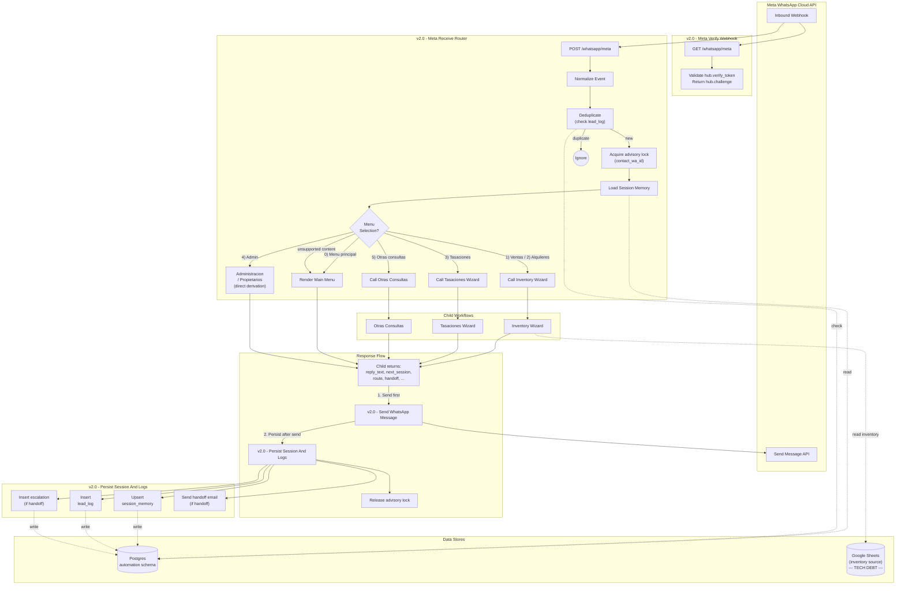

# WhatsApp automation (n8n)

Source: `C:\Desarollo\jperez\n8n\whatsapp-automation-claude`

The platform runs on n8n. The same set of workflows is deployed to each tenant's own n8n instance — the workflow JSON is the unit of distribution. Per-agency adaptation = clone the wizard JSON files and rewrite the JS state machine inside; leave the engine workflows (router, sender, persister, error handler, sync) untouched.

## Workflow files (the engine)

| File | Role | Vertical-specific? |
|---|---|---|
| `v2-meta-receive-router.json` | Entry. GET (verification) + POST (receive). Normalize, dedup, lock, session load, route. | No — router/lock/dedup is generic |
| `v2-send-whatsapp-message.json` | Shared sender. Wraps Meta `/messages` POST. | No |
| `v2-persist-session-and-logs.json` | Shared persister. Upsert `session_memory`, insert `lead_log` (in + out), conditionally insert `escalations`, send SMTP handoff email. | No |
| `v2-error-handler.json` | Global error trap. Log to `escalations`, throttled alert email, fallback WhatsApp message to user. | No |
| `v2-sync-inventory.json` | Cron 15-min: Sheets → `automation.inventory` upsert. | Mostly no — schema generic, source ID is per-tenant |
| `v2-inventory-wizard.json` | 5-step search wizard (single Code node JS state machine). | **Yes** — vocabulary is real-estate |
| `v2-tasaciones-wizard.json` | 6-step valuation form. | **Yes** — vocabulary is real-estate |
| `v2-otras-consultas.json` | 3-step general inquiry form. | Mostly no — generic intake pattern |
| `v2-emprendimientos.json` | Project listing + advisor handoff. | **Yes** — vocabulary is real-estate |
| `v2-crm-reminders.json` | Cron 15-min: a due CRM reminder → WhatsApp to the advisor who owns the opportunity (`crm_reminder` template), then marks it notified. **The only workflow that writes `dashboard.*`, and it writes one column.** Office hours only. Live on `client1` only. See `references/crm-leads.md`. | No — but each tenant needs its own approved template, the URL button prefix is per-domain |

## Architecture diagram (verbatim from `architecture-v2.md`)


```mermaid
flowchart TD
    subgraph META["Meta WhatsApp Cloud API"]
        WH_IN["Inbound Webhook"]
        WH_OUT["Send Message API"]
    end

    subgraph VERIFY["v2.0 - Meta Verify Webhook"]
        GET["GET /whatsapp/meta"]
        CHALLENGE["Validate hub.verify_token<br>Return hub.challenge"]
        GET --> CHALLENGE
    end

    subgraph ROUTER["v2.0 - Meta Receive Router"]
        POST["POST /whatsapp/meta"]
        NORM["Normalize Event"]
        DEDUP["Deduplicate<br>(check lead_log)"]
        LOCK["Acquire advisory lock<br>(contact_wa_id)"]
        SESSION["Load Session Memory"]
        MENU{"Menu<br>Selection?"}
        RENDER_MENU["Render Main Menu"]
        ADMIN["Administracion<br>/ Propietarios<br>(direct derivation)"]

        POST --> NORM --> DEDUP
        DEDUP -->|duplicate| STOP(("Ignore"))
        DEDUP -->|new| LOCK --> SESSION --> MENU

        MENU -->|"0) Menu principal"| RENDER_MENU
        MENU -->|"4) Admin"| ADMIN
        MENU -->|"1) Ventas / 2) Alquileres"| CALL_INV
        MENU -->|"3) Tasaciones"| CALL_TAS
        MENU -->|"5) Otras consultas"| CALL_OTHER
        MENU -->|unsupported content| RENDER_MENU
    end

    subgraph CHILDREN["Child Workflows"]
        INV["Inventory Wizard"]
        TAS["Tasaciones Wizard"]
        OTHER["Otras Consultas"]
    end

    CALL_INV["Call Inventory Wizard"] --> INV
    CALL_TAS["Call Tasaciones Wizard"] --> TAS
    CALL_OTHER["Call Otras Consultas"] --> OTHER

    subgraph RESPONSE["Response Flow"]
        CHILD_RETURN["Child returns:<br>reply_text, next_session,<br>route, handoff, ..."]
        SEND["v2.0 - Send WhatsApp Message"]
        PERSIST["v2.0 - Persist Session And Logs"]
        UNLOCK["Release advisory lock"]
    end

    INV --> CHILD_RETURN
    TAS --> CHILD_RETURN
    OTHER --> CHILD_RETURN
    RENDER_MENU --> CHILD_RETURN
    ADMIN --> CHILD_RETURN

    CHILD_RETURN -->|"1. Send first"| SEND
    SEND --> WH_OUT
    SEND -->|"2. Persist after send"| PERSIST
    PERSIST --> UNLOCK

    subgraph PERSIST_DETAIL["v2.0 - Persist Session And Logs"]
        UPSERT_SESSION["Upsert<br>session_memory"]
        INSERT_LOG["Insert<br>lead_log"]
        INSERT_ESC["Insert escalation<br>(if handoff)"]
        SEND_EMAIL["Send handoff email<br>(if handoff)"]
    end

    PERSIST --> UPSERT_SESSION
    PERSIST --> INSERT_LOG
    PERSIST --> INSERT_ESC
    PERSIST --> SEND_EMAIL

    subgraph DATA["Data Stores"]
        PG[("Postgres<br>automation schema")]
        SHEETS[("Google Sheets<br>(inventory source)<br>--- TECH DEBT ---")]
    end

    SESSION -.->|read| PG
    DEDUP -.->|check| PG
    UPSERT_SESSION -.->|write| PG
    INSERT_LOG -.->|write| PG
    INSERT_ESC -.->|write| PG
    INV -.->|read inventory| SHEETS

    WH_IN --> GET
    WH_IN --> POST
```

## Execution order (per inbound message)

Steps marked **[2026-09]** are the conversational upgrades — live on client1, not yet on other
tenants (see §Conversational upgrades below).

```
1.  POST /whatsapp/meta fires (Meta webhook)
2.  Respond immediately with onReceived (don't keep Meta waiting)
3.  Normalize event — extract text_body, contact_wa_id, message_id, profile_name, message_type
    [2026-09] + media_id, media_mime_type, is_voice for media (audio stays event_kind 'unsupported')
4.  Check for duplicate (direction='inbound', message_id) in automation.lead_log
    — if found, short-circuit and exit (idempotency)
4b. [2026-09] Burst buffer, BEFORE the lock: Peek Session → Plan Buffering → Should Buffer?
    — buffer: Buffer Inbound (runtime.inbound_buffer) → wait 4 s → Consume Buffer
      (runtime.consume_inbound_buffer) → Build Grouped Inbound; no rows = another execution
      answers the group, this one ends quietly
    — bypass (inside a flow, or a message complete on its own, or any buffer DB error): Bypass Buffer
    — both converge on Inbound Ready
5.  Acquire Postgres advisory lock on hash(contact_wa_id)
    — guarantees serialized processing per contact
6.  Load session from automation.session_memory by contact_wa_id
    — apply SESSION_MEMORY_TTL_MS (default 30 min) — if stale, treat as new session
6b. [2026-09] Voice note → Is Audio? → Get Media Meta → Size OK? → Download Media → Fix Binary Name
    → Audio Format OK? → Transcribe (OpenAI) → Resolve Inbound. Every false branch and HTTP error
    output also lands in Resolve Inbound (exactly one item, lock always released).
7.  Determine menu selection or resume guided flow
    — main menu 0-5 / admin / restart
    — [2026-09] post-handoff window (24 h): acknowledge + forward to the advisor instead of the menu
    — [2026-09] resolve a sentence against the options on screen ("tres habitaciones" → key 3)
8.  Call appropriate child workflow with { session, normalized_event }
9.  Child returns shared contract:
    {
      reply_text:               string,
      next_session:             updated session_memory shape,
      route:                    string ID of the child + step,
      handoff:                  boolean,
      escalation_reason:        string or empty,
      handoff_target:           string ('valuations'|'sales'|'rents'|'questions'|...),
      preferred_contact_slot:   string or empty,
      qualification_snapshot:   JSONB to merge into session_memory,
      matched_listings:         array (optional, from inventory wizard),
      should_update_session:    boolean (false for read-only turns)
    }
9b. [2026-09] Decorate Reply — prepend "🎤 Escuché: «…»" when a voice note was answered at a
    free-text step or in the post-handoff window
10. Call v2-send-whatsapp-message — POST to Meta with reply_text, capture outbound_message_id
10b. [2026-09] Attach Inbound Context — re-add transcript + absorbed_messages (wizards drop unknown fields)
11. Call v2-persist-session-and-logs:
    — upsert session_memory (if should_update_session)
      [2026-09] a handoff stamps last_handoff_at / last_handoff_target / followup_notifications
    — insert lead_log (inbound row)
      [2026-09] one row per absorbed message of a burst; a transcript is logged as the text
    — insert lead_log (outbound row) with related_message_id linking back
    — if handoff: insert escalations row + send SMTP alert
      [2026-09] handoff_followup: WhatsApp notification only ("💬 Mensaje adicional del lead"),
      no escalation row, no email
12. Release advisory lock
```

## Conversational upgrades (2026-09, live on client1)

Built on client1 as a POC from patterns in a partner's n8n kit (`KIT-N8N-ALUMNOS/` in the engine repo), and **meant to be ported to every tenant**. Procedure: `whatsapp-automation-claude/PORTING-conversational-upgrades.md`. History and rollback ids: `MIGRATION-handoff-followup-client1.md`, `MIGRATION-audio-client1.md`, `MIGRATION-burst-grouping-client1.md`, `_client1_backup/_versions.txt`.

| Upgrade | Behaviour | Cost / requirement |
|---|---|---|
| **Post-handoff window** | For 24 h after a handoff, a new message gets "Recibido 👍 …" and is forwarded to the advisor (max 5 notifications per handoff). Acknowledgements ("gracias", "ok 👍") get a reply without paging. `0`, a button or a bare `1`–`6` leave the window. Survives the 30-min session TTL. Logged as `route: handoff_followup`, `handoff: false`, so dashboard handoff rates don't move. | none |
| **Voice-note transcription** | Voice notes are transcribed (`gpt-4o-mini-transcribe`, `language=es`) inside the per-contact lock and routed like text. Unusable audio (too long, silent, hallucination, any API error) → "No pude entender tu audio", step kept. | `OPENAI_API_KEY` **with prepaid credits**; voice notes are processed by OpenAI (tenant privacy notice) |
| **Sentence → option resolution** | When a wizard shows a list, `Determine Route` matches the message against the `guided_options` labels (spelled numbers → digits, longest label wins); a lone number counts only when every other word is filler. "tres habitaciones" → 3, "quiero hablar con un asesor" → the advisor option, "Tres de Febrero" stays a zone. Typed text benefits too. | wizards store `guided_options: [{key,label,value}]` |
| **Burst grouping** | Outside an active flow each message waits 4 s and the newest answers the group: joined text, with restart words and option numbers checked on the last message and keywords on the whole group. Options, restart words, buttons and media close a group at once; max hold 15 s. One `lead_log` inbound row per WhatsApp message. | 4 s on the first reply outside a flow; `runtime` schema (see `postgres-schema.md`) |
| **Cooldown by family** (plec's alternative to burst grouping) | `Read Session Memory` returns the menu-class routes sent in the last `MENU_COOLDOWN_MS`; `menuFamily()` collapses variants, and a reply is silenced only if its *family* already went out. Two different media in a row get two acknowledgements; two identical menus get one. Lives in `lead_log`, so it works across the 30-min session TTL. | none; `MENU_COOLDOWN_MS` (120000) |
| **Media capture** | After the reply is sent, a branch downloads the voice note / image / document from Graph and stores it in `automation.media_assets` (bytea; a failure still writes a row whose `fetch_status` says why). Retention sweep rides on every insert. A store failure is recorded as `fetch_status='store_failed'` and `verify` turns red on it. Reads the binary with `getBinaryDataBuffer` (works in both n8n binary modes). | ~45 media/month × ~42 KB ≈ 10 MB at a 90-day steady state; `MEDIA_CAPTURE_ENABLED` / `MEDIA_MAX_BYTES` (5 MB) / `MEDIA_RETENTION_DAYS` (90); tenant privacy notice (three copies with their own clocks: Meta ~30 d, n8n execution binaries ~11 d, the table 90 d) |

**Adoption per tenant** (the record of who has what — update it when a row of a tenant's tech-debt queue is paid):

| Upgrade | client1 | plec | ventas | tasty | arka |
|---|---|---|---|---|---|
| Post-handoff window | 2026-09-15 | — (if ported: anchor on `automation.escalations`, not `session_memory`) | — | — | — |
| Voice-note transcription | 2026-09-15 | 2026-09-25 (own OpenAI key) | — | — | — |
| Sentence → option | 2026-09-15 | 2026-09-25 (+ spoken numbers, positional "la segunda") | — | — | — |
| Burst grouping | 2026-09-15 | **replaced** by cooldown by family | — | — | — |
| Cooldown by family | — | 2026-09-27 | — | — | — |
| Anti-loop `dormant` guard | (ventas origin) | 2026-09-16, all six wizards | 2026-09 | — | 2026-09 |
| Media capture (n8n) | **2026-09-30** (`patch-tenant-live.mjs client1 media`, router `960ccecf`; verified same day with a real photo, PDF and voice note, 3/3 byte-exact) | **2026-09-27** (+documents 09-28) | — (external router: port into `Sales Automation/_src`) | — (engine: same target; measure the anchor first) | — (bot off) |
| `media_assets` table present | 2026-09-28 (empty) | 2026-09-25 | 2026-09-28 (empty) | 2026-09-28 (empty) | 2026-09-28 (empty) |
| Media in the dashboard (shared image, PRs #44 + #45) | UI present on next recreate; nothing captured → "ya no disponible" | **2026-09-28** | same as client1 | same as client1 | same as client1 |

The per-tenant queue of what is still missing lives in `Plec Automation/docs/plec-arquitectos/plan-media-v2.md` §"Deuda técnica"; artbox has no dashboard and arka's bot is off (Chatwoot mode), so neither captures media.

**Design rules that made it work** — each one fixed a real bug:
- Transcribe **inside** the lock. Download + transcription takes 2–6 s; before the lock, a voice note and a typed "2" are processed out of order.
- Audio stays `unsupported` until a transcript exists; otherwise an empty text reaches a free-text step and hands off an empty request.
- Wizards rebuild their output field by field, so anything added before routing is re-attached after the sender.
- Wizards accept only a number or an exact label, so sentence matching lives once in `Determine Route` instead of in each wizard. **This was caught by the real-WhatsApp smoke test, not by unit tests** — always smoke-test voice answers at option steps.
- Normalize spoken numbers only against options on screen, or the barrio "Once" becomes option 11.
- The buffer's Postgres nodes send errors to `Bypass Buffer`: a DB problem degrades to one-by-one processing, never to dropped messages.
- n8n's Postgres node emits `{success: true}` for a zero-row result, so "nothing absorbed" is detected by inspecting rows.
- **An edge proves nothing about reachability** (plec, 2026-09-27: the media branch shipped with every topology check green and stored nothing for a day). An `executeWorkflow` node whose output is `[[]]` — the shared persister call — **ends the branch**: n8n runs nothing downstream of a node that emitted no items, so `Release Advisory Lock` had run 2 times in 100 executions. Anchor new branches on a node **measured** to run (`/executions?includeData=true`, count), and make `verify` read execution data, not just `connections`.
- **Binaries: only `await this.helpers.getBinaryDataBuffer(i, 'data')`.** With `N8N_DEFAULT_BINARY_DATA_MODE` unset, n8n 2.x stores binaries on disk and `binary.data.data` is the literal string `"filesystem-v2"`, which passes a `typeof === 'string'` check and fails `decode()` in Postgres.
- **A node after the reply must never throw.** The router's `errorWorkflow` writes an escalation, emails, **and sends the lead** *"Disculpa, tuvimos un problema tecnico…"*. Use `continueErrorOutput` and wire the error output to something that records the failure (plec: `Store Failed` → a `store_failed` row); an unwired error output is a silent failure. `Receive Meta Event` is `responseMode: onReceived`, so a late error never causes a Meta retry either way.
- **Documented kill switches have to exist in the container.** `--env-file` only feeds compose interpolation; a variable the compose does not name is never injected, and plec ran for eleven days with none of its seven tunables reachable. Declare them as `${VAR:-default}` and audit with `docker exec <n8n> printenv`.

**Wizard contract requirements added** (check before porting): option steps store `guided_options: [{key, label, value}]`, free-text steps store `guided_options: []`, and a handoff leaves `guided_step: 'handoff'`.

**Deployer:** `node scripts/patch-tenant-live.mjs <tenant> <target>` with `scripts/tenants.json` (API base, workflow ids, key env vars; `routerSource: "external"` for a tenant whose router is another repo's — ventas — which limits the deployer there to `inbox`, `crm-reminders` and `verify`). Structural targets `normalize` → `audio` → `burst` insert nodes by exact name, and refuse half-applied graphs, dangling `$('…')` references, changed Execute Workflow ids and concurrent saves. `verify` runs 35 read-only checks. Five local suites (364 assertions) run the real `jsCode` from the JSON with stubs. The `n8n-deployer` agent knows both this pipeline and the per-agency `_src` one.

## Conversation hardening (defaults for EVERY new automation, 2026-09-17, extended 2026-09-28)

These behaviours started as fixes on the outbound tenants (`ventas`, then `tasty`) after real
incidents. They are **not vertical-specific**: ship them with any new tenant, inbound or outbound.
Working implementation to copy: `bot-argento-sales/Sales Automation/n8n/wizards/_src/ventas.js`,
`_src/router-determine-route.js` and `scripts/burst/`; for §6b–§8 the most complete version is
tasty's (`TastyLivingSoil/Tasty Automation/n8n/wizards/_src/{ventas,router-determine-route}.js`
and `scripts/sim/`).

### 1. ⚠ The per-contact advisory lock does NOT serialize concurrent executions

`Acquire Advisory Lock` runs `SELECT pg_advisory_lock(hashtext($1))`. That is a **session-level**
lock tied to the Postgres connection, and n8n's Postgres node reuses a pooled connection, where the
lock is **re-entrant** — a second execution "acquires" it in ~3 ms while the first still holds it.
On top of that, `Release Advisory Lock` **never runs**: it hangs off `Call Persist Session And Logs`,
which emits no items, so n8n stops there and the lock leaks on that connection.

Proven on ventas (execs 37010/37013, 2026-09-17): two webhook messages 439 ms apart both read an
empty session, both answered, and the second overwrote the first — the anti-loop counter stayed at
`0` after two unrecognized inputs. **Assume every router has this bug.** It is invisible with human
typing (seconds apart) and routine with auto-responders, which fire two messages at once.

Burst grouping (below) covers it in practice, because every message waits ≥4 s before consuming
while processing takes ~1 s. A proper fix — replacing the session lock with a transactional claim,
the way `consume_inbound_buffer` uses `pg_advisory_xact_lock` **inside a function** — is still open.

### 2. Burst grouping is the default, and outbound groups inside flows too

Ship `runtime.inbound_buffer` + the 9-node chain on every tenant (`PORTING-conversational-upgrades.md`).
Two deltas found while porting to ventas:

- **A tenant without the audio chain has no `Inbound Ready` node**, and `router-burst-topology.mjs`
  refuses to run without it. Insert a standalone `Inbound Ready` (noOp) between the chain and
  `Acquire Advisory Lock` instead of shipping audio just to unlock grouping.
- **client1 groups only outside an active flow; outbound must group inside flows too.** The dominant
  burst there is an SMB auto-responder firing two messages at *any* step, not a human splitting a
  thought. Cost: a 4 s wait when someone types an answer instead of tapping a button.

### 3. ⚠ Burst contract: `Determine Route` must read `Inbound Ready`, not `Normalize Event`

`Normalize Event` holds only the **last** message of a burst. A router that keeps
`const inbound = $('Normalize Event').first().json` will group correctly (one reply) while silently
processing a single message: the wizard sees one line, the lead log keeps one inbound row, and **an
opt-out sent as the first message of a burst is lost** — a compliance hole. Read `Inbound Ready`,
falling back to `Normalize Event`. Same for anything downstream that needs the full text.

Test discipline that catches it: stub `Normalize Event` with the **last message only** and put the
grouped payload in `Inbound Ready`, exactly as production does. A harness that feeds the grouped
text to `Normalize Event` passes while production is broken (this shipped to ventas and was caught
by the first real smoke test).

Wizards then read bursts as: `text_body` = lines joined with `\n`, `last_text_body` = last line.
Resolve options **last line first** ("hola" + "2" → option 2), match exact opt-out / defer tokens
**per line** (bias to suppress), and run intent regexes on the whole text.

### 4. Anti-loop guard + the silent turn (`suppress_send`)

A consecutive-miss counter (`guided_misses`, shared across steps, surviving `clearGuided()`): miss 1
re-asks, miss 2 sends one goodbye re-showing the buttons and parks the session in `dormant`, where
unrecognized input emits **`suppress_send: true`** and nothing leaves. Caps any bot-vs-bot loop at
**2 outbound messages**. Requires two engine-side pieces, both backwards compatible:

- **Sender:** a `Check Suppress Send` switch (`{{ $json.suppress_send === true ? 1 : 0 }}`) between
  the trigger and the HTTP node; output 1 goes straight to `Build Response`, which already returns
  `outbound_message_id: ''` / `send_success: false` and spreads `...input`, so the flag survives to
  the persister. No extra node needed.
- **Persister:** push the outbound `lead_log` row only `if (data.suppress_send !== true)`; the
  inbound row is always logged, so the inbox shows no empty outgoing bubbles.

With >1 step that can miss, store which step you parked from (`dormant_from`) — otherwise waking up
cannot pick the right prompt. Exclude `handoff`/`closed` from the guard **on purpose**: silencing
there strands an already-qualified lead who writes back.

### 5. Never dead-end a lead: price intent + free-text handoff

A real lead wrote *"Enviame valores y lo evaluo"* at an option step; the wizard answered
*"No te entendí"* and re-sent the brochure. The lead went unanswered for five days and no alert
fired, because handoff only triggered on a button tap. Two rules for every wizard:

- **Price intent** (`/\b(precio|valor|cuanto|costo|cuesta|sale|presupuesto|tarifa|abono)\b/`) answers
  with the real numbers **at any step** except `handoff`/`closed`, and fires handoff + alert.
- **Free text that looks like a question** (has `?` or ≥3 words) at a warm step hands off with the
  lead's own words quoted in the summary, instead of repeating the menu.

Both gated by an **auto-responder blocklist** (`horario de atención`, `dejanos tu consulta`,
`a la brevedad`, `gracias por comunicarte`, `bienvenido`) so machines don't generate false handoffs
and alerts; they keep falling through to the anti-loop guard.

### 6. Opt-out: exact tokens + regex fallback

Exact-token matching misses real refusals. After the token check add
`/\bno\b.{0,20}\binter[eé]s\w*/` and `/\bno\b[,.\s]{0,3}gracias\b/`, extract the branch into a
`buildOptOut()` helper, and keep bare "no" a valid wizard answer. Verified in production on ventas:
*"por el momento no estamos interesados … gracias!"* was suppressed by the regex three days after
deploy — the exact tokens would have missed it.

### 6b. Declines that never say "interés": closed business, wrong number, has a supplier

Real replies on tasty (2026-09): *"El vivero cerró"*, *"ya no tengo más la plantería"*, *"No es
más el NRO del vivero"*, *"Ya tenemos proveedor"*. None matches §6, so they reached the wizard,
which handed them off and answered *"¡Perfecto! Le paso tus datos…"*. Two of the four then had to
tap the opt-out button to be left alone. Route all three families to `optout`, matched on an
**accent-free** copy (people write "cerro", "numero"):

- **closed** — "cerró" as a whole word after a business noun (vivero/local/negocio/growshop…) and
  closing the clause or followed by "hace"/"definitivamente"; "ya no tengo(mos) (más) el/la
  <negocio>"; "dejamos de trabajar/vender".
- **wrong number** — número/nro + negation or "equivocado" ("no es más el nro", "número equivocado").
- **has a supplier** — first-person "tenemos/tengo … proveedor", "ya trabajamos con otra marca".

Suppression is **permanent**, so every pattern needs an unambiguous marker: "cerramos a las 18",
"estamos cerrados, abrimos el lunes" (temporary — often an auto-responder) and seeded business
names like "Vivero El Cerrito" must NOT match. Reply to closed/wrong-number with a plain apology
("Gracias por avisar 🙏 Disculpá la molestia.") — a warm "cualquier cosa, acá estamos" reads odd to
a stranger. Whether "ya tenemos proveedor" is permanent or a soft defer is a per-client call.

### 7. Auto-responder detection: two signals, and the delivery blind spot

The §5 blocklist is the start; tasty's first campaign day showed its size: **9 of the first 13
handoff alerts were the prospects' own away-bots** (growshops/viveros run WhatsApp Business greeting
messages). Any "free text → handoff" rule needs both signals, applied to **free text only** (a
button tap is always human). On a hit, emit nothing at all — no reply, no alert, no state change —
so the human who later taps a button walks the flow normally.

1. **Wording** — normalize first: lowercase, strip accents **and WhatsApp markdown** (`_…_`,
   `*…*`; one bot sent `_Gracias por comunicarte con_ _*Distribuidora 520.*_`). Grow the phrase
   list from production: every variant seen so far includes `gracias por comunicarte`,
   `te comunicaste con`, `bienvenidos a`, `en que (te) podemos ayudar(te)`, `horario de atencion`,
   `horario de respuesta`, `a/en la brevedad`, `en unos instantes`, `mensaje (en) automatico`,
   `no podemos responder`, `disponibles para atenderte`, `ni bien me conecte` (full list:
   tasty's `BOT_PHRASES`).
2. **Timing** — free text arriving **≤30 s after our template send** is a machine. Measured on
   tasty: every same-second auto-reply landed at 5–26 s; the quickest human took 59 s. Needs
   `last_send_at` from `outreach.recipients` (surface `EXTRACT(EPOCH FROM NOW() - last_send_at)`).
   ⚠ `Number(null) === 0`: skip the check when there is no send (organic contacts), or you mute
   them.

**The blind spot:** timing counts from **send**, not **delivery**. When the prospect's phone is
offline, the away-bot fires on delivery — observed at 315 s, 3478 s and 5062 s — so only wording
can catch those. Delivery time lives in Meta's status webhooks, which the engine doesn't process
yet; a status consumer would close this gap.

**Cleanup rule:** if a bot ever gets through, delete its escalation row. In any wizard that mutes
after a handoff by reading `escalations`, a false row silences that contact **forever**.

### 8. Keep regression harnesses in the repo, fed with real messages

Every hardening fix above was verified by an offline harness that runs the real `_src` with
`$`/`$env`/`$execution` stubbed. Two rules after tasty lost its harnesses (they lived in a session
scratchpad, wiped 2026-09-23):
- **In the repo** (`scripts/sim/`), run before every `patch-wizard-live.mjs`, exit 1 on failure.
- **Verbatim incident messages as fixtures, both directions:** every real bot/decline that caused
  an incident must route correctly, AND every real **human** reply from the campaign must still
  reach the human — the negative control that stops a broader phrase list or regex from quietly
  swallowing leads. Tasty's suites: 53 wizard scenarios, 75 router routes.

## Two-way inbox (human takeover)

The dashboard's `/inbox` lets an admin take a conversation, reply by hand, and release it; while
taken, the bot stays silent. Live on ventas (2026-08-13) and client1 (2026-09-18). Portable version:
the engine repo (`v2-inbox-webhook.json`, `scripts/lib/router-inbox-topology.mjs`,
`patch-tenant-live.mjs <tenant> <inbox|inbox-router>`, `MIGRATION-inbox-client1.md`).

- **Data:** `automation.conversation_control` (`mode` `bot|human`, `taken_by`, `expires_at`),
  `automation.lead_log.sent_by` (`'human'` for agent messages) and `v_conversation_control`
  (`is_human_controlled`). Written only by n8n; `dashboard_app` has SELECT on the view.
- **Webhook** `POST /webhook/inbox` (`X-Inbox-Token`), actions `send` / `takeover` / `release`:
  - `send` returns 401 for a bad token, 400 for a bad request, **403 if opted out** (checked first,
    fail-closed, conditional on `outreach.suppression` existing), 409 outside the 24 h window and
    502 if Meta rejects the message. It goes out through the tenant's sender and is logged with
    `sent_by='human'`.
  - A **takeover expires after 24 h by default** (`expires_in_hours` 1–720) so a forgotten takeover
    can't silence the bot forever. ventas ran the older `expires_at = NULL` build until 2026-09-26,
    when `patch-tenant-live.mjs ventas inbox` synced it; both tenants now run the same webhook.
- **Router:**
  - `Read Session Memory` LEFT JOINs `conversation_control` (the row exists even without a session).
  - `Determine Route` checks the takeover on the **raw** row (not the TTL-gated profile) and returns
    `route_target: 'human_paused'` with `human_log_rows`.
  - `Route Switch` gets a new output (**raise `numberOutputs` in the same PUT**, or the output
    doesn't exist and n8n drops the item) → `Log Human Inbound` (one `lead_log` row per message,
    `ON CONFLICT DO NOTHING`) → `Release Advisory Lock`.
  - No wizard, sender or persister runs.
- **Order in `Determine Route`:** opt-out first (compliance wins even mid-takeover), then
  `human_paused`, then everything else — restart words, the post-handoff window, option matching.
  A tenant without opt-out (client1 today) puts `human_paused` first and leaves the slot marked.
- **Deploy order:** DB block **before** the router, because the join fails every message without
  the table. Then the webhook, the router, and the dashboard flag + env pair last.
- **Dashboard gate:** vertical `features.inboxTab` **and** both env vars (`inboxEnabled()`). Never
  set them to an empty string — zod rejects it and the whole dashboard fails to boot.

## Wizard pattern (the part you'll copy per vertical)

Every wizard is **a single n8n Code node** containing a JavaScript state machine. The Code node receives `{ session, normalized_event }` from Execute Workflow, switches on `session.last_route` (current step) + the inbound text, and returns the shared contract.

Why one big Code node instead of fan-out across many small nodes:

- The state machine is easier to read and modify in one file.
- Step transitions are pure functions, easy to unit-test (you can copy the function out of the JSON and run it locally).
- Avoids dozens of n8n branches/IFs that would be hard to maintain.

A wizard's typical shape:

```js
// Pseudocode of the wizard pattern
const STEPS = ['ask_zone', 'ask_property_type', 'ask_bedrooms', 'ask_price_range', 'show_results'];

function buildPrompt({ title, instruction, options }) {
  // Returns the WhatsApp-formatted text including '0) Menu principal' footer
}

function handle({ session, normalized_event }) {
  const currentStep = session.last_route?.split(':')[1] ?? STEPS[0];
  const userText = normalized_event.text_body.trim();

  // Restart shortcut
  if (userText === '0') return { reply_text: renderMainMenu(), next_session: clearGuidedState(session), route: 'menu', handoff: false, qualification_snapshot: {}, should_update_session: true };

  switch (currentStep) {
    case 'ask_zone':
      // parse zone, advance
    case 'ask_property_type':
      // ...
    case 'show_results':
      // query inventory, return matched_listings
      // if user picks a listing → handoff: true, handoff_target: 'sales'
  }
}
```

The wizards in v2 follow this shape with significant length (`v2-inventory-wizard.json` is ~29 KB; the JS inside is a couple thousand lines).

## Interactive messages (WhatsApp reply buttons)

Since the Plec v2.1 patch (2026-05-22), the engine supports **Meta interactive reply buttons** as an additive extension to the text-only payload. Wizards opt in by emitting an optional `buttons[]` field; the sender branches on its presence; the router translates incoming button taps back into the same `text_body` shape that wizards already parse.

### Pricing + Meta API constraints

- Interactive reply buttons are **session messages**, not templates. They are **free** within the 24h customer-initiated service window (which is the only mode the bot ever operates in). No Meta pre-approval needed.
- Max **3 buttons** per message. For more options, use interactive **list messages** (up to 10, organized into sections — same plumbing pattern, different payload).
- `button.title` ≤ 20 chars UTF-8. `button.id` ≤ 256 chars — use it as a semantic key (`"si"`, `"no"`, `"buscando"`, `"no_se"`).
- Reference: <https://developers.facebook.com/docs/whatsapp/cloud-api/messages/interactive-messages>

### Wizard contract (additive)

The wizard's return object gains an optional field:

```js
buttons: [
  { id: 'si',       title: 'Sí' },
  { id: 'no',       title: 'No' },
  { id: 'buscando', title: 'Estoy buscando' }
]
```

If `buttons` is absent → existing text-only path. If present → sender builds interactive payload. Order matters in WhatsApp's UI; first item is leftmost.

### Three-layer change (already shipped in engine)

**Router — `Normalize Event` Code node**: accepts `messages[0].type === 'interactive'` with `interactive.type ∈ {button_reply, list_reply}`. Sets `text_body = reply.id` (the semantic key) and `message_type = 'interactive_button_reply'` (or `_list_reply`). `event_kind` stays `'text'` so the downstream routing logic is unchanged. Wizards see `text_body` exactly as if the user had typed the button's id.

**Sender — `Send WhatsApp Message` HTTP node `jsonBody`**: an expression that branches on `Array.isArray($json.buttons) && $json.buttons.length`. When buttons are present it builds `{ type: 'interactive', interactive: { type: 'button', body: { text: reply_text }, action: { buttons: [...] } } }`. Otherwise it falls back to the text payload. Wizards that don't emit buttons keep working identically — fully backward-compatible.

**Wizards — `resolveOption(opts, input)` helper**: accepts BOTH numeric key (`"1"`) AND semantic id (`"si"`). So a step that emits buttons can also be answered by:
1. Tapping the button (Meta sends `interactive.button_reply.id = 'si'` → router translates → wizard sees `text_body = 'si'`)
2. Typing the literal text (`"si"`, `"no"`) — fallback for clients that don't render interactive messages
3. Typing the legacy numeric key (`"1"`, `"2"`) — works as long as `<option>.key` matches; useful if the wizard previously rendered the options as a numbered list and users have it from history

Buttons replace the numbered list for that prompt. Reply body shows only the question; tap-friendly UI replaces the visible enumeration.

### Pattern for adding buttons to a new step

In the wizard JS:

```js
const promptYesNo = (snapshot, errorPrefix = '') => {
  const next = { ...snapshot, guided_step: 'yes_no', guided_options: yesNoOptions };
  const reply = buildPrompt({
    title: flowLabel + ' ' + flowEmoji,
    instruction: 'Question text?',
    options: [],            // ← no numbered list; buttons replace it
    errorPrefix
  });
  const buttons = yesNoOptions.map(o => ({ id: o.value, title: o.label }));
  return finalize({ reply, route: routePrefix + '_yes_no', snapshot: next, buttons });
};
```

The `finalize()` function needs to accept `buttons` and pass it through to the returned `json` payload conditionally:

```js
return [{
  json: {
    reply_text: finalReply, route, intent, /* ... existing fields ... */,
    ...(Array.isArray(buttons) && buttons.length ? { buttons } : {})
  }
}];
```

In the step parser:

```js
if (guidedStep === 'yes_no') {
  const sel = resolveOption(yesNoOptions, inbound.text_body);
  if (!sel) return promptYesNo(baseSnapshot, 'No entendi tu eleccion.');
  return promptNext({ ...baseSnapshot, yes_no: sel.value });
}
```

### When to use list messages instead of buttons

- > 3 options but ≤ 10: interactive list message (`interactive.type = 'list'`). Same wiring pattern; payload shape differs slightly. Plec's main menu (6 options) is a candidate but not yet migrated.
- For now, opt for buttons whenever options ≤ 3 (better UX than a list dropdown), keep numbered text for 4–10 (matches Plec's m² 4-bucket pattern), and consider list messages later.

## Error handler

`v2-error-handler.json` is wired as the **global Error Workflow** in n8n settings. When any other workflow throws:

1. Log to `automation.escalations` with `escalation_type='workflow_error'`, full execution context (`workflow_name`, `execution_id`, `workflow_id`, `execution_url`, `last_node_executed`, `mode`, `stack`).
2. Send a throttled alert email to `ALERT_EMAIL_TO` (don't drown the inbox on cascading failures).
3. If `contact_wa_id` is recoverable from the failed execution, send a fallback WhatsApp message to the user ("estamos teniendo un problema, te respondemos a la brevedad" or similar) so the conversation doesn't die silently.

This is why the dashboard's `escalations` queries filter on `escalation_type` to separate operational errors from real customer handoffs.

**Two things to know when reading its alerts (tasty, 2026-09-28):**
- **One failure alerts twice.** A sub-workflow error (e.g. the persister's `Send Handoff WA
  Notification`) also fails the router's `Call Persist Session And Logs`, so two emails arrive
  with two execution ids. Read the sub-workflow's execution — it holds the real error
  (`GET /api/v1/executions/<id>?includeData=true` → `resultData.error.description`).
  Meta `#131000 "Something went wrong"` (HTTP 500) is generic and usually transient: check the
  sub-workflow's error rate before treating it as systemic.
- **Anything derived from `escalations` must exclude `escalation_type='workflow_error'`** —
  handoff counts, and above all any "already handed off → mute" flag. Today the handler writes a
  blank `contact_wa_id`, but a row carrying a real contact would silence that lead for good.

## Sync workflow

`v2-sync-inventory.json` runs every 15 minutes:

1. Read sales sheet (Google Sheets node, OAuth2 cred).
2. Read rents sheet.
3. Build upsert SQL keyed on composite PK `(listing_id, source_sheet)`.
4. Execute against Postgres `automation.inventory`.

**Tech debt:** ~~the inventory wizard still reads Sheets at runtime instead of `automation.inventory`. The sync table is populated but unused by the runtime path.~~ **Resolved on client1 2026-09-11:** the wizard's `Read Inventory` is a Postgres node on `automation.inventory` (with `use_type` for vivienda/comercial). Tenants cloned from older exports may still read Sheets — check that node's type before assuming.

## Required environment variables

The n8n instance needs these. Names are stable across agencies; **values are per-tenant** (each tenant has their own Meta access token, phone number, sheet, alert email).

**Required:**
- `META_VERIFY_TOKEN` — webhook verification token (you choose; must match Meta app config)
- `META_ACCESS_TOKEN` — Meta business integration token (rotate per tenant; encrypted in the Tech Provider backend's `credentials` table)
- `META_PHONE_NUMBER_ID` — tenant's WhatsApp phone number ID
- `ALERT_EMAIL_TO` — where handoff + error alerts go
- `ALERT_FROM_EMAIL` — SMTP sender

**Recommended (template-mode handoffs — bypasses Meta's 24h window):**
- `META_HANDOFF_TEMPLATE_NAME` — name of the Meta-approved template used to deliver handoff notifications to the ops team (e.g. `handoff_notification`). When set, the persister's `Prepare Handoff WA Notification` Code node emits a `type: 'template'` payload instead of `type: 'text'`. **Critical for production**: without this, the WhatsApp Cloud API silently drops handoff notifications to numbers that haven't messaged the business in the last 24h. See "Template-mode handoffs" section below.
- `META_HANDOFF_TEMPLATE_LANG` — language code matching the template (e.g. `es_AR`, `es`). Defaults to `es_AR` if unset.

**Optional / per-vertical:**
- `META_GRAPH_VERSION` — default `v22.0`
- `SESSION_MEMORY_TTL_MS` — default `1800000` (30 min)
- `DEFAULT_ASSISTANT_LANGUAGE` — default `es`
- `BRAND_NAME` — generic brand name used by the persister for email subjects + WhatsApp handoff headers. Fallback chain: `BRAND_NAME → ARCHITECTURE_BRAND_NAME → REAL_ESTATE_BRAND_NAME → 'Bot'`. Set the generic `BRAND_NAME` for new tenants; the vertical-specific vars are kept for backward compat.
- `<VERTICAL>_*` — additional per-vertical overrides (currency, market name, sheet ID, etc.). Real-estate uses `REAL_ESTATE_*`; architecture uses `ARCHITECTURE_*`.
- `<UPPER>_WHATSAPP_NUMBER` — per-team internal notification numbers, one per `handoff_target`. **Generic convention since the 2026-05-22 persister patch**: the persister derives the env var name from `handoff_target` itself by uppercasing and replacing non-alphanumeric with underscore, then appending `_WHATSAPP_NUMBER`. So adding a new vertical with handoff targets like `architect` / `technical` / `municipal` just needs those env vars set — no code change required. Examples currently in use:
  - Real estate: `VALUATIONS_WHATSAPP_NUMBER`, `QUESTIONS_WHATSAPP_NUMBER`, `OWNERS_WHATSAPP_NUMBER`, `SALES_WHATSAPP_NUMBER`, `RENTS_WHATSAPP_NUMBER`
  - Architecture (Plec): `ARCHITECT_WHATSAPP_NUMBER`, `SALES_WHATSAPP_NUMBER`, `TECHNICAL_WHATSAPP_NUMBER`, `MUNICIPAL_WHATSAPP_NUMBER`, `DEVELOPMENT_WHATSAPP_NUMBER`, `PURCHASING_WHATSAPP_NUMBER`, `HR_WHATSAPP_NUMBER`
- `OPENAI_API_KEY` — **used since 2026-09 for voice-note transcription** (client1; the OpenAI org needs prepaid credits, otherwise `429 credit_balance_exhausted`). Without the key, audio keeps the text-only reply. `OPENAI_MODEL` (default `gpt-4o-mini`) and `AI_CONFIDENCE_THRESHOLD` (default `0.6`) are still wired but **not used** in v2 wizards (planned for "Otras Consultas" AI triage)
- **2026-09 conversational upgrades** — all optional, defaults live in code (`$env.X || default`), so no compose change unless overriding:
  - `OPENAI_TRANSCRIBE_MODEL` (`gpt-4o-mini-transcribe`), `AUDIO_TRANSCRIPTION_ENABLED` (on; `false` is the kill switch), `AUDIO_MAX_BYTES` (2 MB), `AUDIO_TRANSCRIBE_PROMPT` (built-in real-estate vocabulary — tune per vertical)
  - `HANDOFF_FOLLOWUP_WINDOW_MS` (24 h), `HANDOFF_FOLLOWUP_MAX_NOTIFICATIONS` (5)
  - `INBOUND_DEBOUNCE_MS` (4000; `0` disables grouping), `INBOUND_MAX_HOLD_MS` (15000)

**Sheet ID:** in current real-estate code, hardcoded as `REAL_ESTATE_SHEET_ID=1u4YkqBlPSN6UrUW_ra4hYWuRzEj8fxNp3xqWjjV1-LY` in n8n's variables. Per-tenant: each tenant has their own Sheet ID + their own Google OAuth credential.

## Post-deploy wiring operations

When importing the platform's workflows into a fresh tenant's n8n instance, **don't paste JSONs through MCP `n8n_create_workflow` one-by-one** — for the router alone (21 nodes) that blows up Claude's context fast. The pattern proven on Plec (2026-05-08) and worth reusing:

### 1. Bulk-import via REST API

Write a small Node script (~50 lines) that:
- Reads each `n8n/wizards/v2-*.json` in dependency order (engines → wizards → sync → router last)
- Strips n8n-export-only fields (`pinData`, `meta`, `tags`, `active`, `versionId`) leaving only `{name, nodes, connections, settings}`
- POSTs each to `<n8n-url>/api/v1/workflows` with `X-N8N-API-KEY` header
- Lists existing workflows first to skip duplicates (idempotent re-runs)
- Persists a `manifest.json` keyed `fileName → {id, name}` for the wiring step

Reference implementation: `C:\Desarollo\jperez\plecarquitectos\Plec Automation\scripts\import-n8n.mjs`. Reuse it for any new tenant — just change the API URL.

### 2. Credentials

- `n8n_manage_credentials` MCP action `list` is **not supported** by n8n's public API (returns `GET method not allowed`). The only way to discover an existing credential's ID is via the n8n UI URL.
- `n8n_manage_credentials` `create` works and returns the ID. Use it for Postgres + any non-OAuth credential.
- **OAuth-flow credentials (Google Sheets, etc.) cannot be created via API** — they require a browser popup for the consent dance. Pre-create the shell via MCP if you want to save UI clicks, but the user has to click "Sign in" themselves.

### 3. Wire executeWorkflow IDs + attach credentials via MCP

Use `n8n_update_partial_workflow` with `updateNode` ops. One MCP call can patch many nodes in one workflow:

```jsonc
// Wire all 8 executeWorkflow nodes in the router in one call:
{
  "id": "<router-id>",
  "operations": [
    {"type": "updateNode", "nodeName": "Call Proyecto Wizard",
     "updates": {"parameters.workflowId": "<proyecto-id>"}},
    // ... 7 more
  ]
}

// Attach Postgres credential to many nodes across one workflow:
{
  "id": "<workflow-id>",
  "operations": [
    {"type": "updateNode", "nodeName": "Read Lead Log",
     "updates": {"credentials.postgres": {"id": "<cred-id>", "name": "Postgres <Tenant>"}}},
    // ...
  ]
}
```

### 4. Global error workflow — there isn't one

n8n's API does **not** expose a "global default error workflow" setting. The `errorWorkflow` lives in each workflow's `settings.errorWorkflow`. To wire it across all workflows: PUT loop over each non-error-handler workflow setting `settings.errorWorkflow = <error-handler-id>`. Reference: `scripts/set-error-workflow.mjs` in `Plec Automation/`.

The error handler itself does *not* get its own errorWorkflow (avoid infinite loop on cascading failures).

### 5. Patching jsCode after import (for vertical-specific tweaks)

When the user discovers their Sheet shape differs from the platform's expectations (very common — see "Sheet schema considerations" in `new-vertical-playbook.md`), edit `_src/<file>.js` → rebuild via `node scripts/wizards/build.mjs` → push the new jsCode without re-importing (which would change the ID and break wiring):

1. GET `/workflows/<id>` to fetch the live workflow
2. Find the target Code node, swap `parameters.jsCode`
3. PUT `/workflows/<id>` with the same `{name, nodes, connections, settings}` — credentials and connection wiring are preserved

**PUT body must whitelist settings keys.** n8n's REST rejects `additionalProperties` in `settings` (e.g., the platform writes things like `availableInMCP`, `timeSavedMode` that the API schema doesn't accept on PUT). Whitelist the safe ones:

```js
const ALLOWED_SETTINGS = [
  'executionOrder', 'saveExecutionProgress',
  'saveDataErrorExecution', 'saveDataSuccessExecution',
  'saveManualExecutions', 'callerPolicy', 'errorWorkflow',
  'timezone', 'executionTimeout'
];
```

References:

- **`scripts/patch-wizard-live.mjs <wizard>`** in `Plec Automation/` — generic helper, parametrizable per wizard. Reads `parameters.jsCode` of the `Run Wizard Step` Code node from the regenerated snapshot (`n8n/wizards/v2-<wizard>-wizard.json`) and PUTs to the live workflow. Has a hardcoded `WIZARDS` map of `{ id, json }` per Plec wizard. **Clone pattern**: for any tenant that needs to patch wizards in-place, copy + change the `WIZARDS` map and `N8N_BASE` URL. Requires `PLEC_N8N_API_KEY` env var (or rename for the tenant).
- **`scripts/update-sync-jscode.mjs`** in `Plec Automation/` — older, hardcoded version that only patches the sync-inventory wizard. Predates the generic helper above.

**When to use patchNodeField (MCP) vs the script**:

- **Surgical change** (rename one label, add one entry to a map, etc.): use `mcp__n8n-mcp__n8n_update_partial_workflow` with `patchNodeField` operation — pass `find`/`replace` strings. Atomic.
- **Substantial change** (multiple zones of the jsCode touched, function added/removed, branching logic changed): use the script. Replaces the whole jsCode in one PUT, simpler to reason about.
- **Watch out for `\u` escape sequences in find/replace via MCP**: `\u{...}` (brace form) survives JSON parsing because it's not a valid JSON escape; `\uXXXX` (4-hex form) gets decoded into the Unicode codepoint before reaching the MCP. Avoid `\uXXXX` literals in find strings — use surgical patches that don't include them, or fall back to the script.

### 6. Template-mode handoffs (bypasses Meta's 24h window) ⚠️ critical for prod

**The problem.** WhatsApp Cloud API rule: a business can only send **free-form text** to numbers that have messaged the business in the last 24 hours. The persister's default `Prepare Handoff WA Notification` Code node produces a `type: 'text'` payload. When the ops team number has never written to the business WhatsApp (the common case for a freshly provisioned tenant), Meta accepts the POST with **200 OK** but **silently discards the delivery**. Handoffs never arrive. Discovered on Plec the day before go-live (2026-05-29).

**The fix.** Use a Meta-approved **template message** (HSM) for the handoff notification. Templates bypass the 24h window. The persister was upgraded to dual-mode (commit `dea7efa` engine repo, 2026-05-29):

- If `$env.META_HANDOFF_TEMPLATE_NAME` is set → build `type: 'template'` payload with header/body/URL-button components.
- If unset → fallback to `type: 'text'` (legacy behavior, still works for tenants whose ops team has already opened the 24h window).

The HTTP node's `jsonBody` was changed from a hardcoded text payload to `={{ $json.whatsapp_payload }}` so the Code node's output is passed through unchanged.

**Template structure** (the one Plec ships with — clone for new tenants):

```
Name: handoff_notification
Category: Utility (transactional notifications, fewer restrictions than Marketing)
Language: es_AR (or per-locale)

Header (Text): {{1}}                          ← target-specific marker + label
                                                 ex. "⚡ 🏗️ Nuevo lead de Proyecto arquitectonico"
                                                 (max 60 chars including emojis — see #132005 below)

Body:
  Nuevo lead capturado por el bot de Plec Arquitectos.

  Contacto: {{1}}                             ← lead_name
  WhatsApp: wa.me/{{2}}                       ← contact_wa_id digits
  Prioridad: {{3}}                            ← e.g. "T1 - Urgente"

  Resumen del intake:
  {{4}}                                       ← single-line summary
                                                 (NO newlines — see #132018 below)

  Tocá el botón debajo para abrir la conversación en el dashboard.

Footer: <BrandName> · Bot Argento

Button (URL, Visit Website):
  Text: "Ver en dashboard"
  URL type: Dynamic
  Prefix: https://dashboard.<tenant>.botargento.com.ar/conversations/
  Variable: {{1}} (sample: a real wa_id like 5491121911850)
```

The 4 body parameters at the Code-node level are:
1. `contactName` — `lead_name || profile_name || 'Sin nombre'`
2. `contactWaIdDigits` — `contact_wa_id` stripped of non-digits
3. `tierLabel` — `T1 - Urgente` / `T2 - Alto valor` / `T3 - Calificado` / `T4 - Captura`, derived from `PRIORITY_BY_TARGET[handoffTarget]`
4. `summaryTextTemplate` — wizard's `handoff_summary_lines` (or legacy real-estate fields) flattened to one line with ` · ` separator

**Meta restrictions that bit us** (document for future tenants):

- **#132018 — `Param text cannot have new-line/tab characters or more than 4 consecutive spaces`**: template parameters reject `\n`, `\t`, and runs of 4+ spaces. The original `summaryLines.join('\n')` failed. Fix: collapse to a single line with ` · ` separators (only inside the template branch; the text-mode fallback keeps the multiline version).
- **#132005 — `Translated text too long. Length of the parameters and the template text is N, which exceeds the allowed length of M`**: the header is capped at **60 chars total** (template text + resolved parameters). Including emojis and variation selectors. Our original `headerByTarget[target] + ' — ' + brandName` hit 61 chars for some target/brand combos. Fix: drop the brand from the header parameter (it's already in the footer); the header is just the target-specific label.

**Per-tenant onboarding to template mode**:

1. Create the template in Meta Business Suite under the tenant's WABA — Business Settings → WhatsApp Accounts → <tenant> → Message Templates → Create Template. Paste the structure above. Submit for review.
2. Wait for Meta approval (24-72h, often faster). Status changes from `In review` → `Approved` in the templates list.
3. Add to the tenant's `/opt/n8n/<tenant>/.env`:
   ```
   META_HANDOFF_TEMPLATE_NAME=handoff_notification
   META_HANDOFF_TEMPLATE_LANG=es_AR
   ```
4. Add to the tenant's `/opt/n8n/<tenant>/docker-compose.yml` (the `environment:` whitelist on the `n8n` service):
   ```yaml
   META_HANDOFF_TEMPLATE_NAME: ${META_HANDOFF_TEMPLATE_NAME}
   META_HANDOFF_TEMPLATE_LANG: ${META_HANDOFF_TEMPLATE_LANG}
   ```
5. `docker-compose up -d --force-recreate n8n` to pick up the new env vars (a plain `restart` does NOT re-read `.env`).
6. Smoke test: trigger a real handoff. If the recipient hasn't messaged the business in 24h and the message still arrives, template mode is working.

**Plec's deployment** (live since 2026-05-29) is the reference for the pattern. Scripts that automate the persister patch and snapshot sync live in `C:\Desarollo\jperez\plecarquitectos\Plec Automation\scripts\`:

- `patch-persister-template.mjs` — REST PUT the live persister (`Prepare Handoff WA Notification` jsCode + `Send Handoff WA Notification` jsonBody). Clone + change `N8N_BASE` + `WORKFLOW_ID` per tenant.
- `sync-persister-snapshot.mjs` — copy the Code+HTTP node config from the live persister to the engine repo snapshot. Run after any persister change to keep `whatsapp-automation-claude/v2-persist-session-and-logs.json` aligned.

### 7. Validator false positives to ignore

`n8n_validate_workflow` from n8n-mcp has known false positives — don't panic:

- **"Unmatched expression brackets"** on jsCode containing bracket notation (`obj['key']`) or template literals (`${...}`). The "Current" and "Fixed" shown in the error are identical. Ignore.
- **"Send Email" node should be on error path"** when fan-out from a Code node intentionally includes a `Send …Email` sibling on the success path (e.g., handoff notification). Ignore.
- **"Outdated typeVersion"** warnings — annoying but harmless. The workflows run fine on the older versions.

Real lint items to fix: `responseNode mode requires onError: continueRegularOutput` on webhook nodes; missing `onError: continueErrorOutput` on Switch nodes that have an error output configured.

## Cross-references

For n8n mechanics (not specific to this platform), consult the `n8n-mcp-skills` family:

- `n8n-mcp-skills:n8n-workflow-patterns` — how to design webhook + DB + AI agent workflows generally
- `n8n-mcp-skills:n8n-code-javascript` — `$input`/`$json`/`$node` syntax inside Code nodes; this platform's wizards lean heavily on Code nodes
- `n8n-mcp-skills:n8n-expression-syntax` — `{{ }}` patterns, common errors
- `n8n-mcp-skills:n8n-validation-expert` — interpreting `validate_workflow` errors
